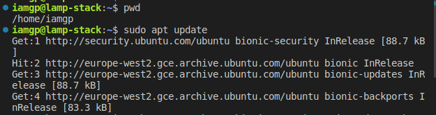
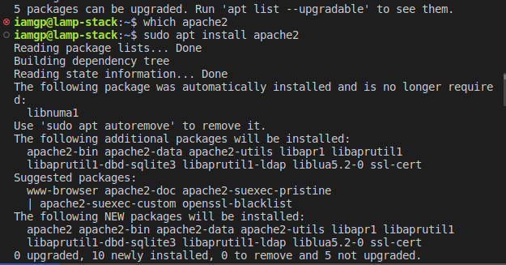
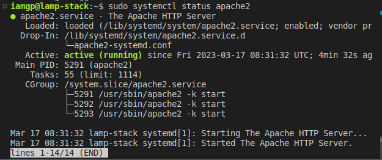

# Lamp Stack Implementation

#### update list of packages in package manager
	`sudo apt update`

#### install Apache Web server using the package manager
	`sudo apt install apache2`

#### verify Apache is running as a service
	`sudo systemctl status apache2`

#### instance firewall configured to allow `tcp traffic` on `port 80`
* this firewall configuration allow incoming traffic from the internet to our web server listening on `port 80`

* using the `curl` command to test connection to our web-server
	`curl http://localhost:80`
	
	![[Pasted image 20230317094928.png]]
* using the browser to test connection to our webserver

	![[Pasted image 20230317095314.png]]

#### install MYSQL Database Server
* *`sudo apt install mysql-server`

	![[Pasted image 20230317100511.png]]

* connection to MYSQL server as `root`
	![[Pasted image 20230317100804.png]]
* create a root password for mysql using `ALTER USER 'root'@'localhost' IDENTIFITED WITH mysql_native_password BY '<my password>'` and `exit`
	![[Pasted image 20230317152957.png]]
* improving MYSQL security

	![[Pasted image 20230317101804.png]]

* Testing MYSQL with root password
	![[Pasted image 20230317153334.png]]
#### install PHP
* installing php and some required libraries / dependencies to enable interaction between apache webserver and mysql
	`sudo apt install php libapache2-mod-php php-mysql`
	
![[Pasted image 20230317102413.png]]

* confirm php successful installation

	![[Pasted image 20230317102552.png]]
#### Create a virtual host for our website using apache
* create a directory for `projectlamp` using the command `sudo mkdir /var/www/projectlamp`

	![[Pasted image 20230317121952.png]]

* also change ownership `(user and group)` from root of the directory to our current user `iamgp`

	![[Pasted image 20230317122344.png]]

* create a new config file with the following configurations for Apache's `sites-available` directory using vi text editor `sudo vi /etc/apache2/site-available/projectlamp.conf`

	![[Pasted image 20230317124309.png]]

	![[Pasted image 20230317124119.png]]

* enabling the new virtual host using `sudo a2ensite projectlamp`

	![[Pasted image 20230317124640.png]]

* to disable the default website that comes with apache, use `sudo a2dissite 000-default`

	![[Pasted image 20230317125134.png]]

* testing your configuration is also important to avoid syntax error, using `sudo apache2ctl configtest`

	![[Pasted image 20230317125343.png]]
* finally, reload apache to make changes take effect using `sudo systemctl reload apache2`
* testing setup page with a dummy `index.html` page at the document root `/var/www/projectlamp/`
	![[Pasted image 20230317134349.png]]
	
	![[Pasted image 20230317134519.png]]
#### Enable PHP on the website
* a change in the piority of file extentions for apache using `sudo vi /etc/apache2/mods-enabled/dir.conf` to make the webserver serve php scripts as piority

	![[Pasted image 20230317135803.png]]
	
	![[Pasted image 20230317135736.png]]
 * finally, reload apache to make changes take effect using `sudo systemctl reload apache2`
 * to test with a php script, `vi /var/www/projectlamp/index.php`
	 ![[Pasted image 20230317140302.png]]
	 ![[Pasted image 20230317140328.png]]