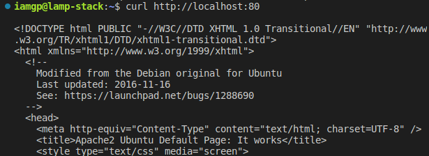
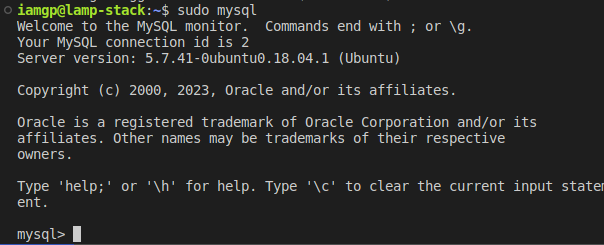
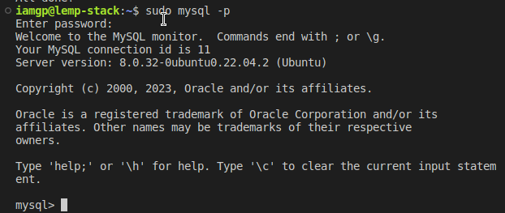

# Lamp Stack Implementation

> update list of packages in package manager

```bash
sudo apt update
```


## Install Apache Web server using the package manager

---

```shell
sudo apt install apache2
```


> verify Apache is running as a service

```shell
sudo systemctl status apache2
```


> instance firewall configured to allow `tcp traffic` on `port 80`

- this firewall configuration allow incoming traffic from the internet to our web server listening on `port 80`


> using the `curl` command to test connection to our web server

```shell
curl http://localhost:80
```



> using the browser to test connection to our web server


## Install MYSQL Database Server

---

```shell
sudo apt install mysql-server
```


> connection to MYSQL server as `root`



> create a root password for mysql using `ALTER USER 'root'@'localhost' IDENTIFITED WITH mysql_native_password BY '<my password>'` and `exit`


> improving MYSQL security


> Testing MYSQL with root password



## Install PHP

---

> installing PHP and some required libraries / dependencies to enable interaction between Apache web server and MySQL

```shell
sudo apt install php libapache2-mod-php php-mysql
```


> confirm PHP successful installation


## Create a virtual host for our website using Apache

---

> create a directory for `projectlamp` using the command

```shell
sudo mkdir /var/www/projectlamp
```


> also change ownership `(user and group)` from root of the directory to our current user `iamgp`


> create a new config file with the following configurations for Apache's `sites-available` directory using vi text editor

 ``` shell
sudo vi /etc/apache2/site-available/projectlamp.conf
 ```


> enabling the new virtual host using

``` shell
sudo a2ensite projectlamp
```


> to disable the default website that comes with Apache, use

``` shell
sudo a2dissite 000-default
```


> testing your configuration is also important to avoid syntax error, using

 ``` shell
 sudo apache2ctl configtest
 ```


> finally, reload Apache to make changes take effect using 

``` shell
sudo systemctl reload apache2
```

> testing setup page with a dummy `index.html` page at the document root `/var/www/projectlamp/`


## Enable PHP on the website
---

> a change in the priority of file extensions for Apache using `sudo vi /etc/apache2/mods-enabled/dir.conf` to make the web server serve PHP scripts as priority


> finally, reload Apache to make changes take effect using 

```shell
sudo systemctl reload apache2
```

> to test with a PHP script, `vi /var/www/projectlamp/index.php`


