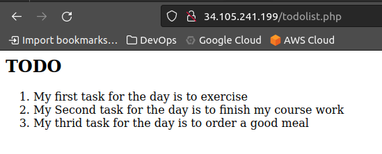

#### install Ngnix Web Server

#### \####`sudo apt update && sudo apt install nginx`


#### verifying that Nginx is installed and running

`which nginx && sudo systemctl status nginx`


#### instance firewall configured to allow `tcp traffic` on `port 80`

#### this firewall configuration allow incoming traffic from the internet to our webserver listening on `port 80`


#### using the `curl` command to test connection to our webserver

`curl http://localhost:80`


#### using the browser to test connection to our webserver


#### install MYSQL Database Server

#### \####`sudo apt install mysql-server`


#### connection to MYSQL server as `root`


#### create a root password for mysql using `ALTER USER 'root'@'localhost' IDENTIFITED WITH mysql_native_password BY '<my password>'` and `exit`


#### improving MYSQL security


#### Testing MYSQL with root password


#### install PHP

#### installing php and some required libraries / dependencies to enable interaction between nginx webserver and mysql

`sudo apt install php-fpm php-mysql`


#### configure NGINX to use PHP Processor

#### create a directory at `/var/www/projectlemp` to serve as the root web directory using `projectlemp` as domain.

`sudo mkdir /var/www/projectlemp`

#### also change ownership `(user and group)` from root of the directory to our current user `iamgp`


#### create a new config file with the following configurations for Nginx's `sites-available` directory using vi text editor `sudo vi /etc/nginx/sites-available/projectlemp`


#### activate configuration by linking to the config file from Nginx's site-enabled directory.

`sudo ln -s /etc/nginx/sites-available/projectllemp /etc/nginx/sites-enabled/`


`sudo nginx -t` tells to test for syntax errors


#### disable default Nginx host


`sudo systemctl reload nginx` to reload and apply changes to Nginx config

#### Testing browser connection


#### Test PHP with NGINX

#### testing to validate that Nginx can correctly handle .php files by handing it off to a PHP processor

`vi /var/www/projectlemp/test.php`


#### checking from the browser


#### Retrieve data from MYSQL Database with PHP

#### connect to MYSQL using root account `sudo mysql -p`


#### create a new database of choice using

```sql
CREATE DATABASE `test_database`;
```


#### create a new user name `test_user`

```sql
CREATE USER 'test_user'@'host' IDENTIFIED WITH mysql_native_password BY 'Admin@1234';
```

#### and also give same user permission over `test_database` only

```sql
GRANT ALL ON test_database.#### TO 'test_user'@'host';
```


#### confirm that `test_user` can see `test_database`

```sql
SHOW DATABASES;
```


#### create a table by running the below statement

```sql
CREATE TABLE test_database.todo_list (
    item_id INT AUTO_INCREMENT,
    content VARCHAR(255),
    PRIMARY KEY(item_id)
);
```


#### insert some content into our `test_database.todo_list` table

```sql
INSERT INTO test_database.todo_list (content) VALUES ("My first task for the day is to exercise");
```


#### confirming records in `content table`


#### create a php script to read data from the database

```php
<?php

$user = "test_user";

$password = "Admin@1234";

$database = "test_database";

$table = "todo_list";

try {

    $db = new PDO("mysql:host=localhost; dbname=$database", $user, $password);

    echo "<h2>TODO</h2><ol>";

    foreach($db->query("SELECT content FROM $table") as $row ) {

    	echo "<li>" . $row['content'] . "</li>";

    }

    echo "</ol>";

}

catch (PDOEXception $e) {

    print "Error!:" . $e->getMessage() . "<br/>";

    die();

}

```

#### testing `todolist.php` script in browser



```

```
