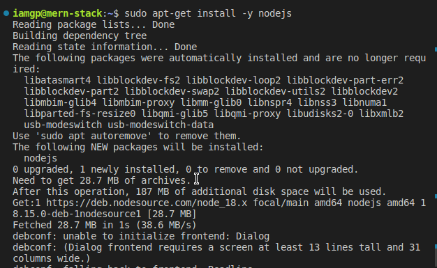

#### backend config

#### updating and upgrading the machine

`sudo apt update && sudo apt upgrade`


#### get NodeJS from ubuntu repo

`curl -fsSL https://deb.nodesource.com/setup_18.x | sudo -E bash -`


#### install NodeJS using `sudo apt-get install -y nodejs`



#### checking installed version `node -v` and `npm -v`


#### make a project directory `mkdir todo`


#### initialize the project using `npm init`


#### install ExpressJS

#### `npm install express`


#### create an `index.js` file


#### installed libraries


#### Express code inside `index.js` file


```javascript
const express = require("express");
require("dotenv").config();

const app = express();

const portNumber = process.env.PORT || 5000;

app.use((req, res, next) => {
  res.header("Access-Control-Allow-Origin", "####");
  res.header(
    "Access-Control-Allow-Headers",
    "Origin, X-Requested-With, Content-Type, Accept"
  );
  next();
});

app.use((req, res, next) => {
  res.send("Welcome to Express");
});

app.listen(port, () => {
  console.log(`Server running on port ${portNumber}`);
});
```

#### allow traffic on port `5000` to ExpressJS Server


#### running the Express Server from CLI and moving the process to background


#### confirming connection via the browser on `port 5000`


#### create routes for the api using `http methods` like `GET, POST, DELETE, PUT`


```javascript
const express = require("express");
const router = express.Router();

router.get("/todos", (req, res, next) => {});

router.post("/todos", (req, res, next) => {});

router.delete("/todos/:id", (req, res, next) => {});

module.exports = router;
```

#### install mongoose


#### create models directory


#### testing backend code for database connection


#### testing `GET` method api via postman


#### testing `POST` method api via postman using raw json data


#### backend api server listening on `port 5000`


#### testing `DELETE` method api via postman using raw json data


#### install client side dependencies and proxy config


#### installing `concurrently and nodemon` as dev dependencies


#### running dev script using concurrently

      


#### install `axios http lib`


#### firewall config to allow traffic to `port 3000`


#### testing front-end app on `port 3000`


#### data from mongodb\####


