#### update and upgrade of machine

```bash
sudo apt update -y && sudo apt upgrade -y
```

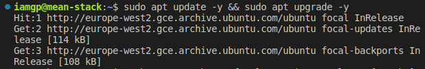

```bash
sudo apt -y install curl dirmngr apt-transport-https lsb-release ca-certificates
```

#### 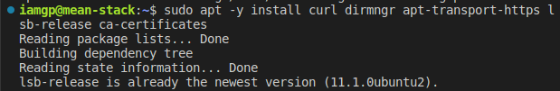

```bash
curl -sL https://deb.nodesource.com/setup_12.x | sudo -E bash -

```

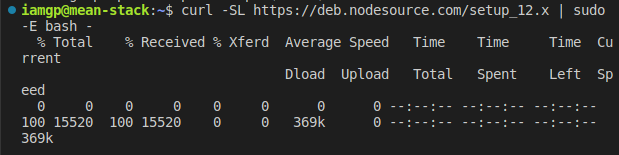
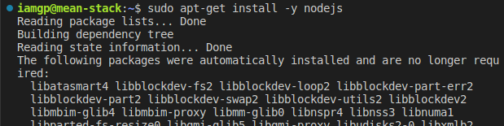

#### installing MongoDB

```bash
sudo apt-key adv --keyserver hkp://keyserver.ubuntu.com:80 --recv 0C49F3730359A14518585931BC711F9BA15703C6

```

```bash
echo "deb [ arch=amd64 ] https://repo.mongodb.org/apt/ubuntu trusty/mongodb-org/3.4 multiverse" | sudo tee /etc/apt/sources.list.d/mongodb-org-3.4.list

```

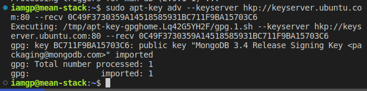

```bash
sudo apt install -y mongodb

```

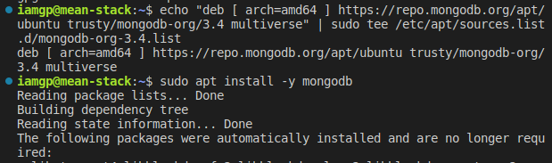

#### start the mongo server

```bash
sudo systemctl start mongodb.service
```

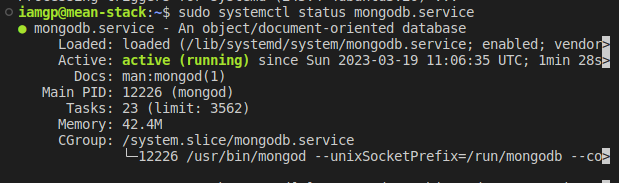
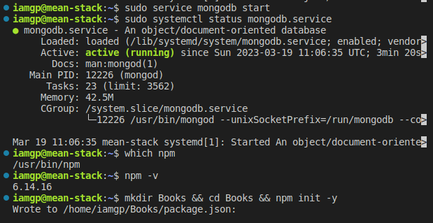
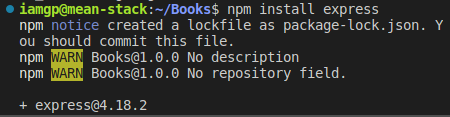

#### install other required dependencies

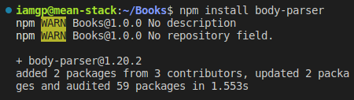
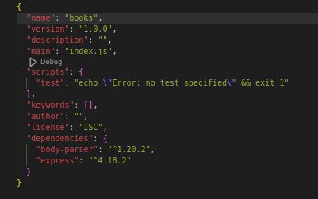

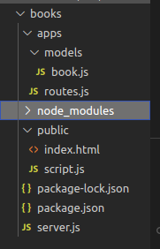

#### app tested on port 3300

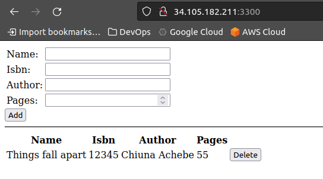

#### app working on cli

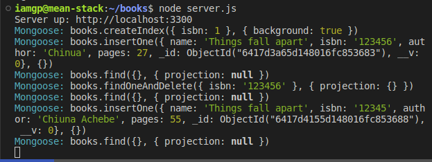

#### important point to note

#### The app needed `NodeJS version 14` and above to run due to some unsupported newer syntax

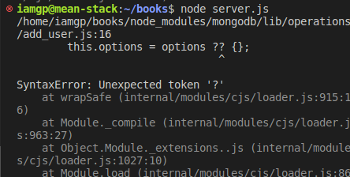

#### There are some mongoose function that no longer support call back and hence the need to use `async await` promised based syntax

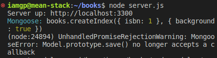
